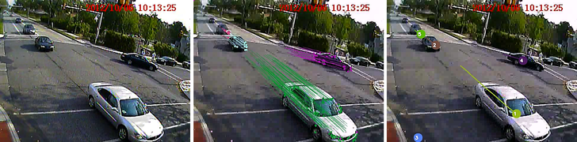

Vision Based Vehicle Tracking
=============================

- Demo video (YouTube)
- Webpage (abstract, methodoloy, paper, datasets, etc.)

### Required programs & libraries

                   Tested Version
    - Linux        Ubuntu 14.04 LTE
    - Make         3.81
    - OpenCV       2.4.8 (if installed with apt-get, do "pkg-config --modversion opencv" to check installed version)
    - gcc          4.8.2 (using colorgcc in Makefile)

You also need a video and specify its location in the Makefile.

### Overview of Programs ###

Boxes are programs and ellipses are input/output files.

### Project directory structure

    - bin            Directory containing object and executable files.
    - intermediate   Directory containing files used between programs.
    - Makefile       File for compiling C++ code.
    - MATLAB         Directory containing MATLAB code (used for prototyping).
    - src            Directory containing C++ code.
   
### List of commands to build & run

`make extract_bg`

Extracts background model from video and stores it in `intermediate\bg.txt`.

`make extract_traj`

Extracts trajectories from video and stores it in `intermediate\traj.txt`. It uses `intermediate\bg.txt`.

`make group_traj`

Groups trajectories from video. It uses `intermediate\traj.txt`.

`make play_video`

Plays video between specified range.

For further options and other programs, see `Makefile`.
